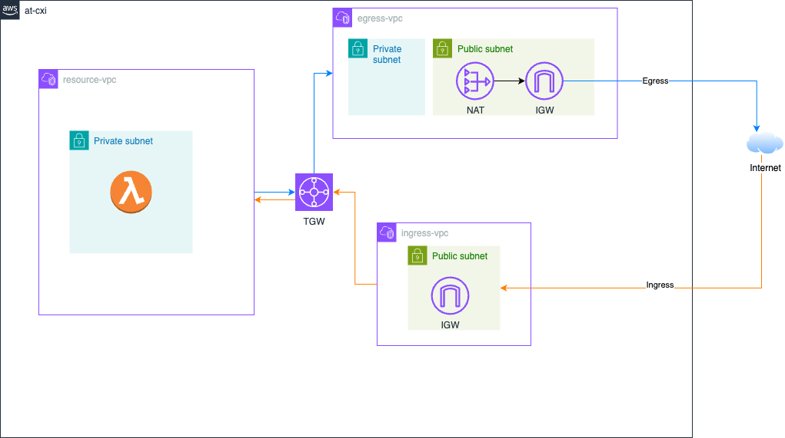

# at-cxi-infra

This project sets up a secure, modular AWS Landing Zone using Terraform. It includes:

- Three separate **VPCs**:
  - **Workload VPC** with two private subnets
  - **Ingress VPC** with two public subnets (for Public ALB)
  - **Egress VPC** with both public and private subnets (for NAT Gateways)

- **AWS Transit Gateway (TGW)** for interconnecting the VPCs
- **Route tables, subnet associations, and TGW routing rules** to enforce:
  - Only workload-to-egress traffic for internet access
  - Only ALB-initiated inbound traffic to workload
- **NAT Gateway** and **Internet Gateway** setup for secure egress

## 📐 Architecture Diagram

